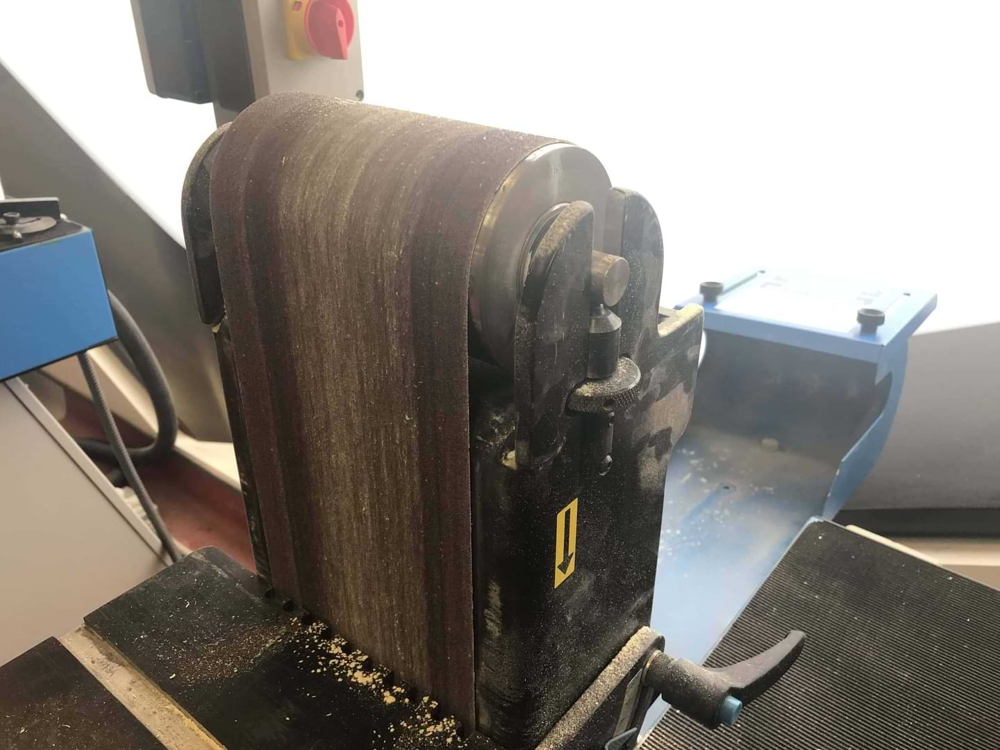
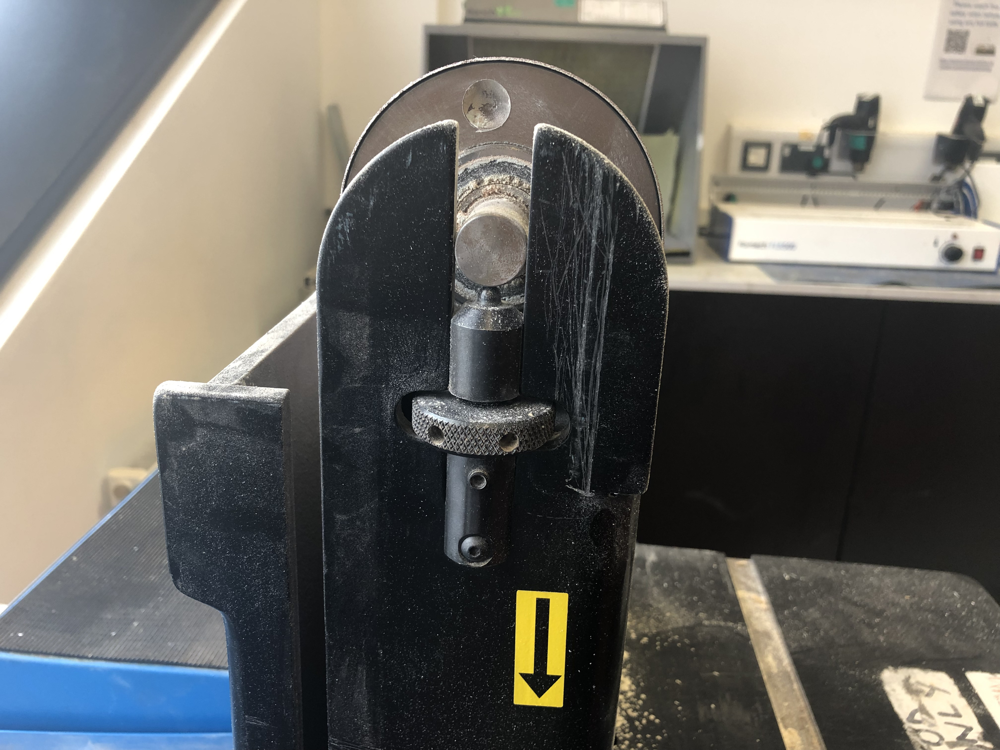

---
## Root Cause

The top roller is not leveled horizontally, causing the belt to slightly slide to one side instead of staying in the same position.

## Fix

Unscrew the bolt at the back on the machine, lift the guard up then the casing, shown below.

**WEAR GLOVES**, manually turn the belt while adjusting the two knobs on the side. When the belt stops sliding to either direction and the tension is reasonable, put the casing back and insert the screw.

---

##### If have any other problems or still not working, please contact hardware team
