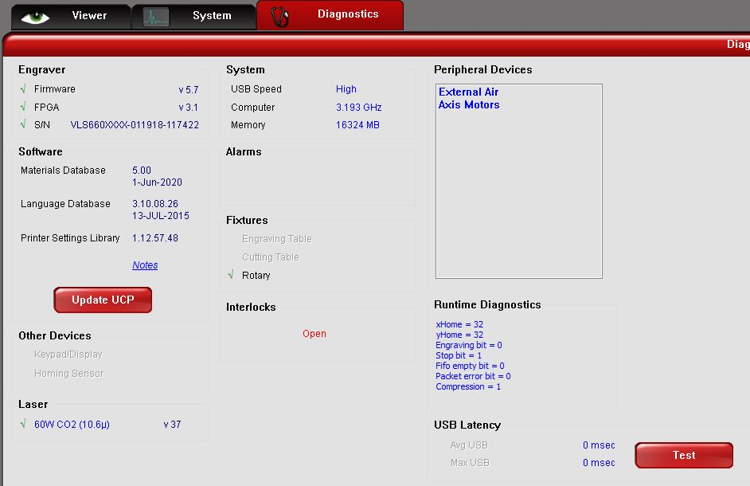
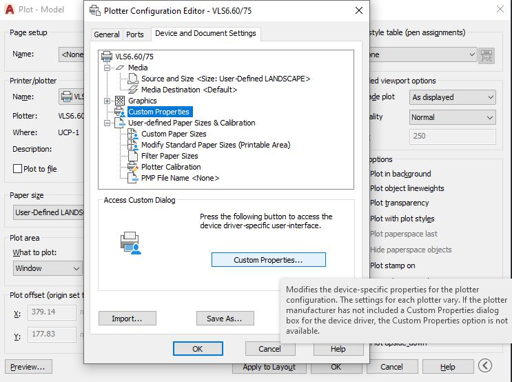
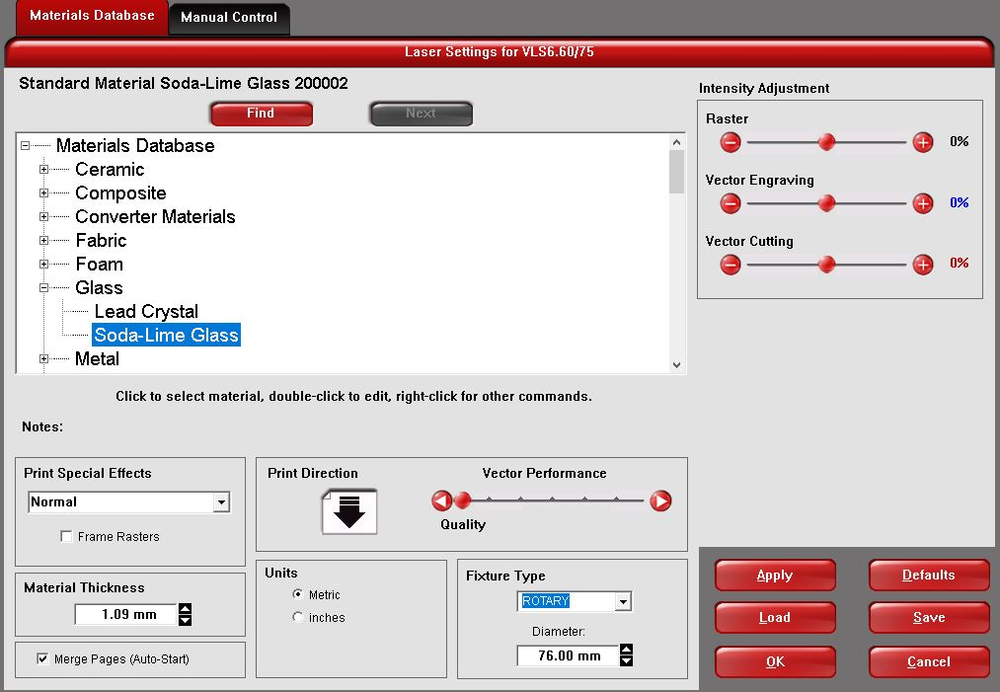
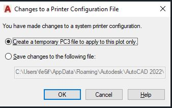
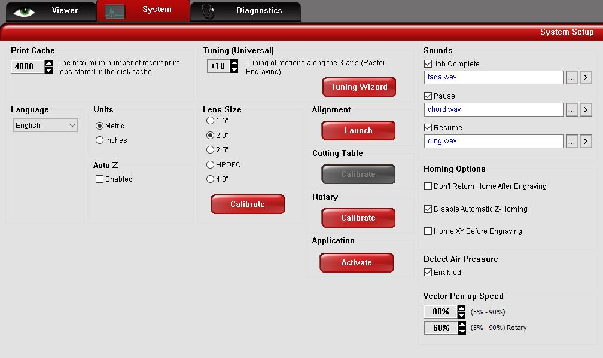
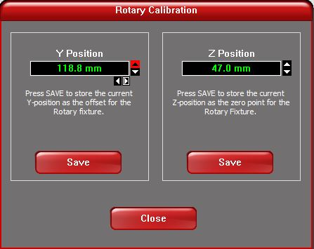
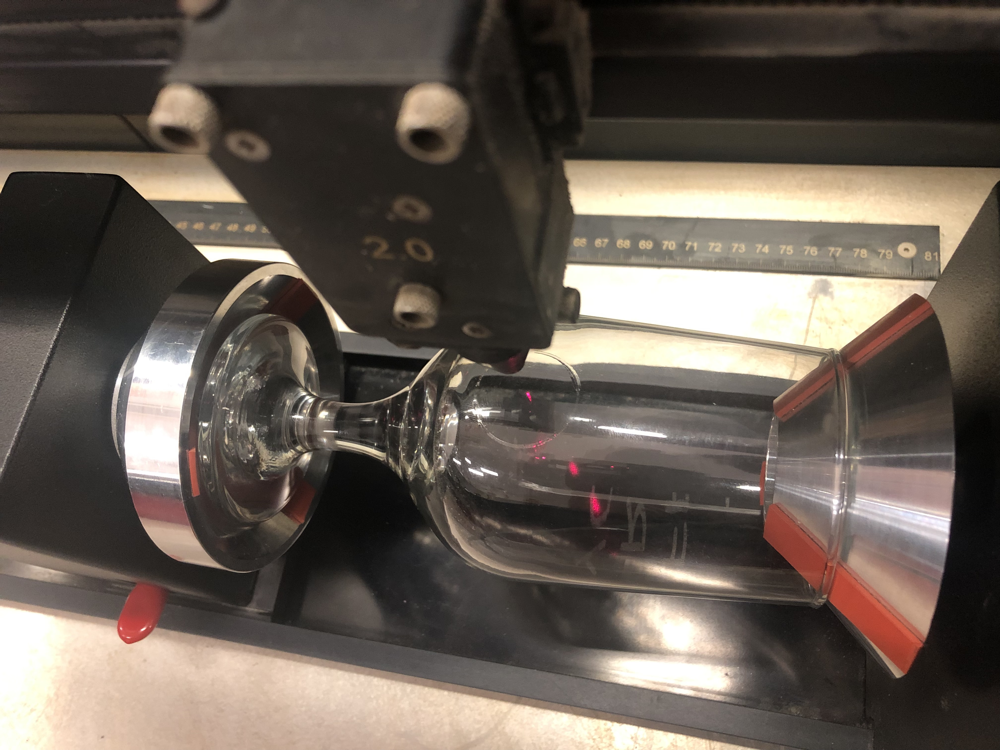
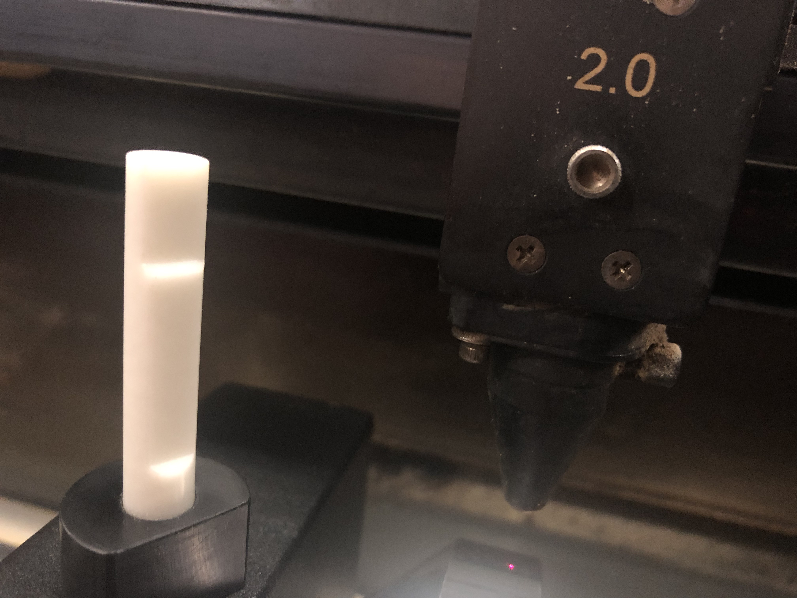
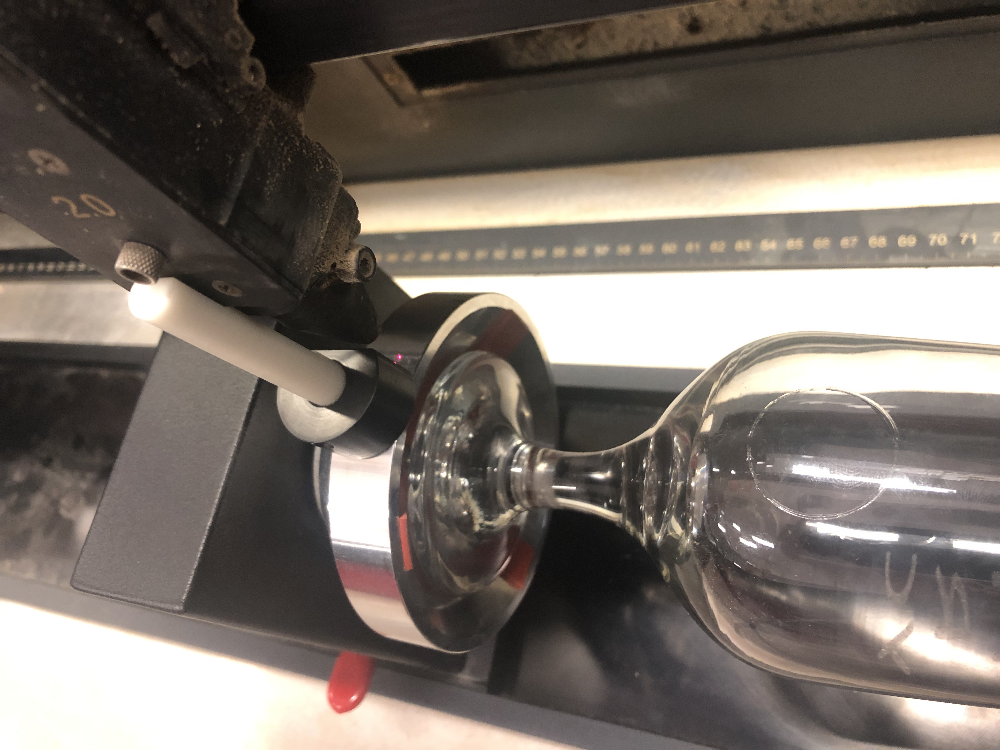
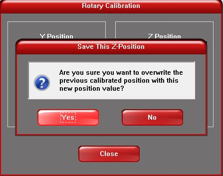

---

##### You can find the detailed guide on [Denford User Manual](https://drive.google.com/file/d/1IyAsj-jD_J0kd2ileiqaxWBShWAYpwG0/view?usp=sharing) (p79-82)

1. Take out the bed.

2. Find the rotary engraving attachment in the box underneath the machine, make sure the bed is low enough that the laser nozzle doesn't crash with the rotary fixture.

3. Locate Pegs form the rotary part on the RHS pegs, slot together from above.

4. Plug in the grey cable from the rotary engraver into the RHS of the inside of the laser cutter. You can check the connection by go to the ULS software - Diagnostics. You should see the **rotary** is ticked on the 'Fixture' section, shown as below.

5. The surface of the glass must be parallel to the bed. If it is angled use scrap wood to angle the rotary fixture until the glass is parallel with the bed.

6. Open your design in AutoCAD, remember Not to use Red since it's cutting mode. Once you click **print** you need to click on **Properties** --> **Custom Properties** and select the setting as shown below accordingly. 

7. You have to make sure material is selected to **Soda-Lime Glass**, the Diameter and Thickness are measured from the part where you'd like to engrave on your object, and the **Fixture Type** is **Rotary**, shown below.

8. <strong>This is an important step. </strong> Make sure you save the configuration as a temporary file as shown below, this is because although it will create a lot of extra files but won't interfere with the calibration. 

    

#### Calibrating the Rotary Fixture 
This is recommended doing everytime since doesn't take too long and can elinimate most risks.

1. Open the ULS software, open the system tab, the **Rotary Calibrate** should be enabled, the cutting table calibrate should be greyed out. Make sure you have **Disable Auto Z** and click **Disable Automatic Z-Homing**, shown below.

2. Click rotary calibrate, you can move the nozzle by clicking the arrow buttons.

    

3. Move the nozzle to the middle line (rotating axis) to calibrate the Y axis, position is shown below. Once ready click **save**.

    

4. Take out the calibration focus tool from the white box near the box where rotary fixture is kept. You can find the notch on the calibration focus tool should fit the laser nozzle assembly, the calibration focus tool is the black and white plastic bit shown below.

5. Place the calibration focus tool on the steel disk and slowly adjust the X axis movement and then Z axis to make sure the notches on the calibration focus tool fits the nozzle assembly. The position is shown below. Once ready click **save**

    

## Congratulations! You've finally made it!!! Now let's send it to print and engrave! Wooooo!!

---

##### If have any other problems or still not working, please contact hardware team (Slack #hardware).
