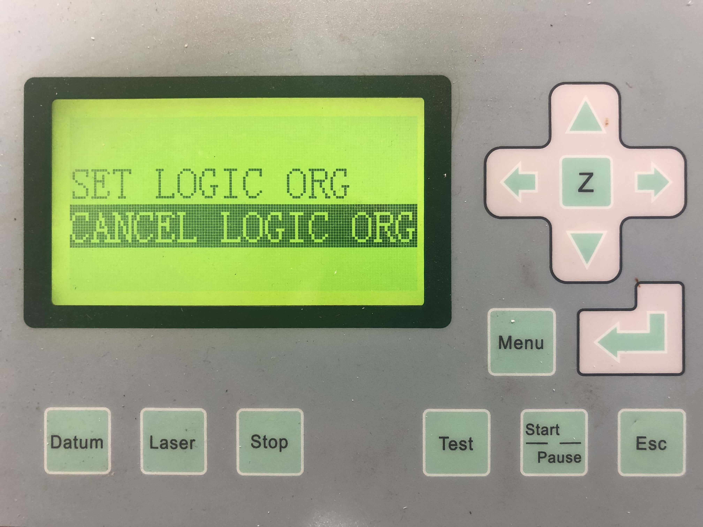

## Set and Cancel Logic Org(origin)

When the files are selected on the panel and the nozzle is positioned at where you wish then click "Enter" once. (Shown below)

Then press **Right** arrow key to select "Cancel Logic Org", press "Enter".(Shown below)

##### If have any other problems or still not working, please contact hardware team
