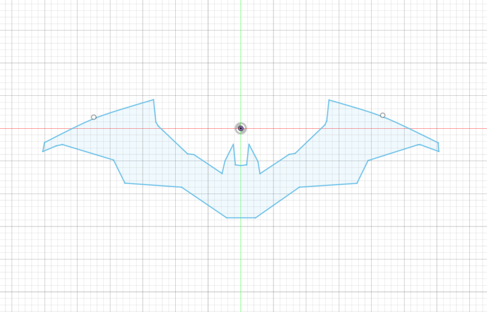
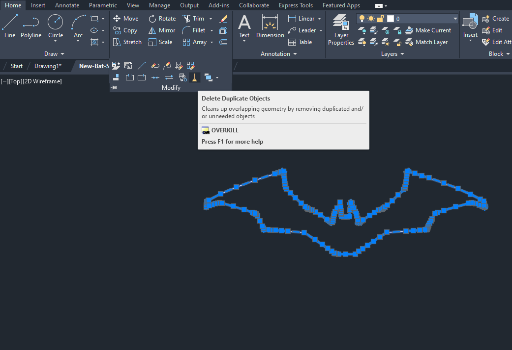
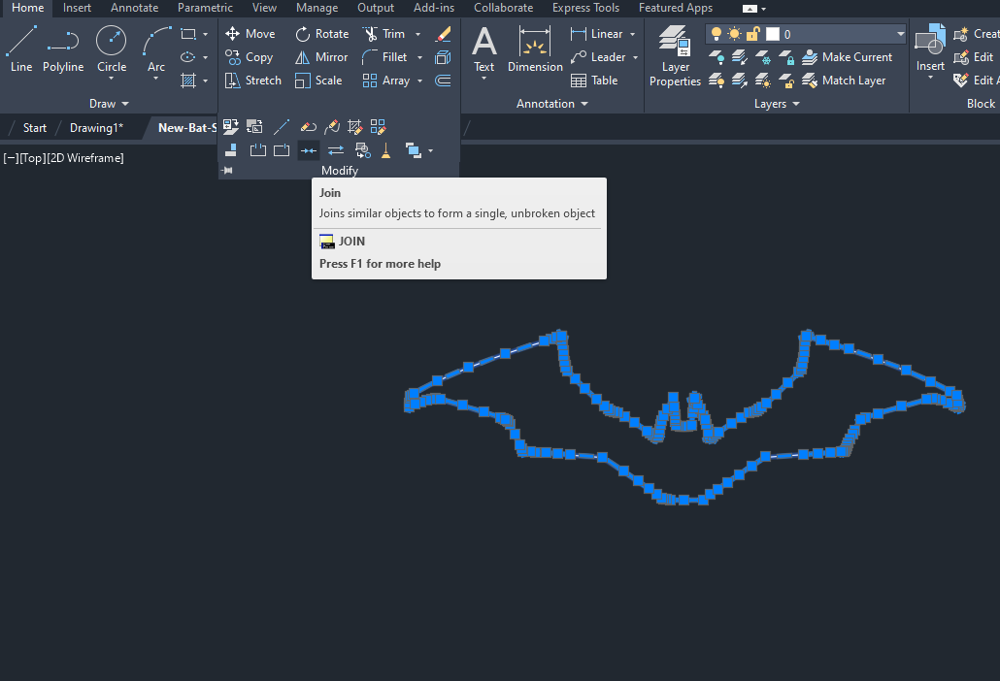

---

 

Sometimes when saving sketch as DXF files in Fusion ⬇️

The same file will appear in the Lasercut 5.3 software when imported like ⬇️

In order to fix this issue, it's recommended to clean the DXF in AutoCAD.

**Usually there are two functions needed:**

1. Overkill - Deleting duplicate drawings

2. Unit - Similar to 'unit lines' in Lasercut 5.3

---

##### If have any other problems or still not working, please contact hardware team (Slack #hardware).
