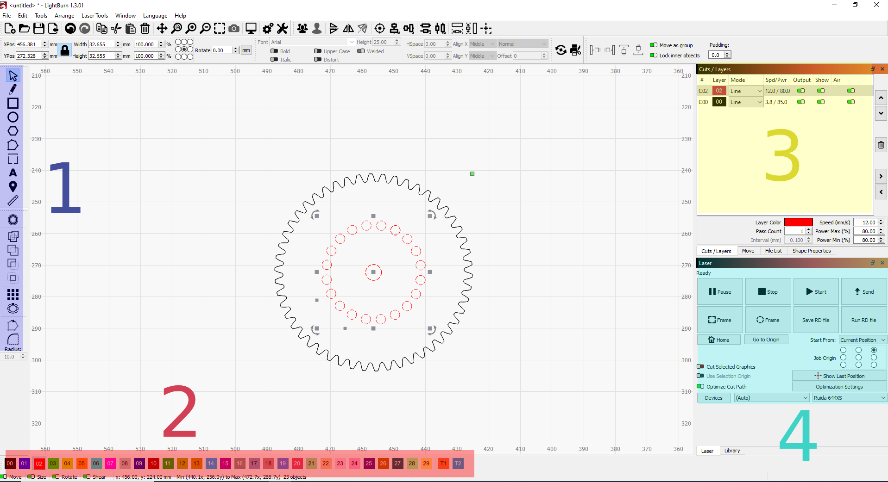
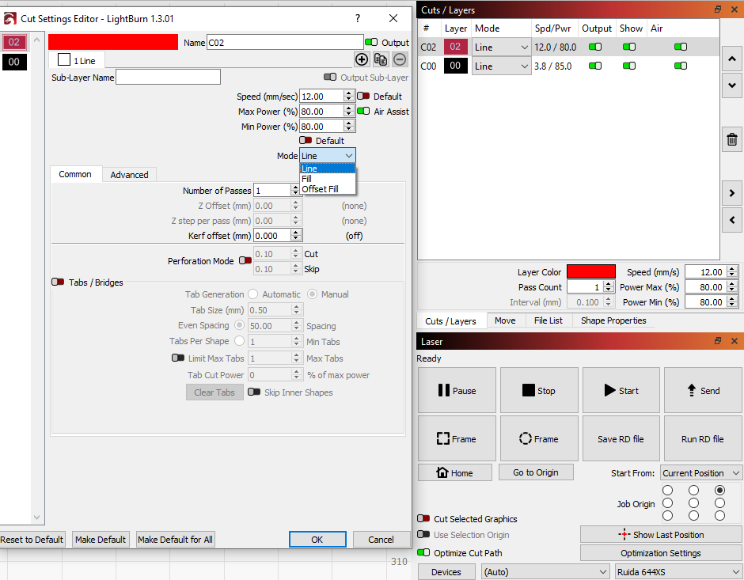

 

### Using LightBurn software
<!-- Hello world! :DDD-->
1. Go to **File** -> **Import** to import your DXF (or other CAD drawing) file

You can see four highlighted area in the LightBurn software interface

##### Area 1. Drawing and Editing Bar
The vertical bar labeled '1', you can use the functions inside to draw and edit your cutting file.

##### Area 2. Colouring Bar
You can select certain parts of your drawing and decide the order of cuts, this can be used to optimize your operation. For example in the gear drawing shown above, the holes inside the gears are colour red and they will be cut first in order. You can see in Area 3 there are two cutting profiles now, both are same cutter parameters (ignore the numbers above, the cutting parameter should be the same for one material) but the red comes before black.

##### Area 3. Cutting Parameter Bar
This bar set the cutting parameter, you can double click the setting to open the detailed view, shown below.

Speed and power are suggested on the spreadsheet for differet materials and thicknesses, '**Line**' Mode is for **Cutting**, '**Fill**' Mode is for **Raster Engraving**, for **Vector Engraving** just use faster speed or/and lower power. You can also control the order of operations by click the up and down button to move accordingly.

##### Area 4. Sending file to HPC laser cutter
When you're statisfied with your drawing, cutting operation, cutting parameters, click **Send**. Please name your file so you can easily find it.

---

*If you have complete all steps above your file has been succesfully sent to the laser cutter and ready to cut.*

### Using the Laser Cutter with Control Pannel shown below

1. **Do Not click Esc when Resetting**, this will cause serious issue.

2. Click **Reset**, this a preventive measure and will clear any potential issue with previous use.

3. Click **File** to select the file you just uploaded, note that you can double check the geometry and cutting parameters on the really lovely cutie amaizing screen. Then click **Enter**.

4. Move the nozzle by the direction arrow keys to your designed starting position, use the lovely **Laser Height Gauge** to adjust the focus. You put the height gauge on the top surface of the material, align the top of the gauge level with the ring on the nozzle. You can press the big **Up** or **Down** button to adjust the height of the bed, the ideal position is shown below.

5. Almost there! Click **Origin** to set the current position as where your cutting operation begins, this is the same on the green square indictated on the LightBurn software (by default is the top right corner). Click **Frame** to allow the nozzle to move and visualize a rectangle that contains all of your drawing. You can use this to check whether your drawing fits on your material.

6. Now you're ready to cut and engrave! Click **Start** to start!

**Dont forget to turn of the extraction!**
 

---

##### If have any other problems or still not working, please contact hardware team (Slack #hardware).
