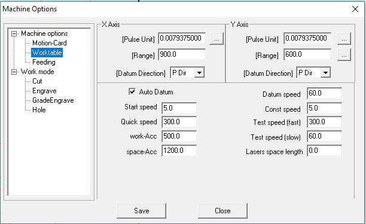
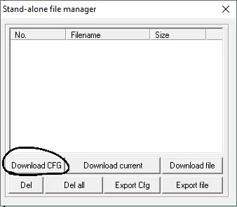

 

1. Go to File -> Machine options -> Worktable. Check if the "auto-datum" is clicked.

 

 

2. Go to File -> Machine options -> Feeding. Check if the "auto-datum" is clicked.

 

## Root Cause

If both "auto-datum" above is not clicked and user do not press datum first every time when they start the machine, the machine will set the current position of the nozzle as the datum reference. Thus, it will have a wrong info of the exact location of the entire machine's bed, and nozzle will be likely crashing into where it should not be.

## Fix

Click the both "auto-datum" stated and shown above. This will enable the machine to auto home the datum every time it's been turned on to avoid nozzle crashing. 

Click **download CFG**, you will hear a beep meaning the updated configuration has been stored in the machine now. (**please do not ignore this step otherwise any changes in setting won't be saved in the machine**)

---

##### If have any other problems or still not working, please contact hardware team
