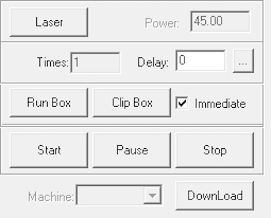
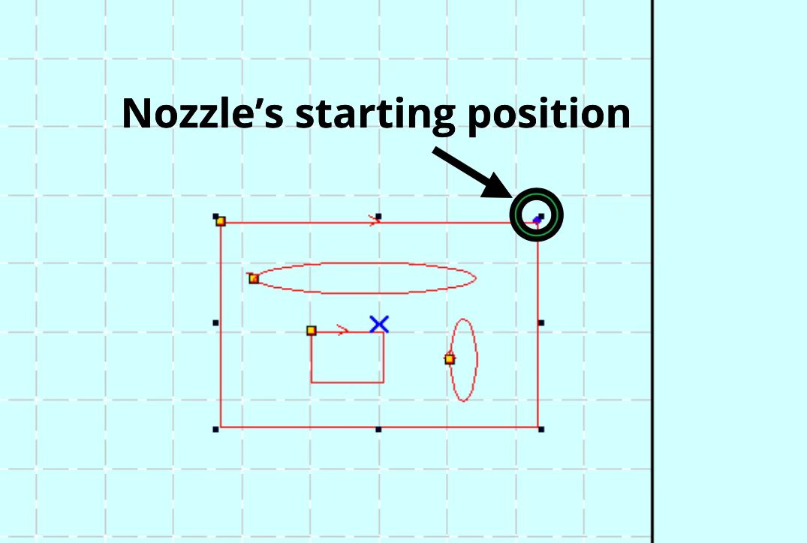

 

1.  Check if "immediate" is clicked, if so it starts cutting where the nozzle is left at when Downloading "current" to the machine.

 

 

2.  Check the position of the nozzle on the software. **NOTE** that the blue dot in the top right corner of the shape indicates the starting position of the nozzle, shown below.

 

 

3. Check the position of the nozzle on the machine. The images below is only an example shown. The blue rectangular path is the intended cutting path according to the software.

 

## Root Cause

which is going outside the machine. NOTE that the blue dot in the top right corner of the shape indicates the starting position of the nozzle.  In order to avoid actual crash, thus SOFT STOP.

## Fix

There are 2 ways to fix this.

 

1. Jog the nozzle to somewhere you think it's okay, press "test" on the control panel before start cutting to see if it will cut within the boundary.

 

2. Alternatively, unclick the "immediate". Now if you download "current" to the machine, it will start where the blue dot is, relatively in the software. Press "test" to check before start cutting.

 
 

###### If have any other problems or still not working, please contact hardware team
