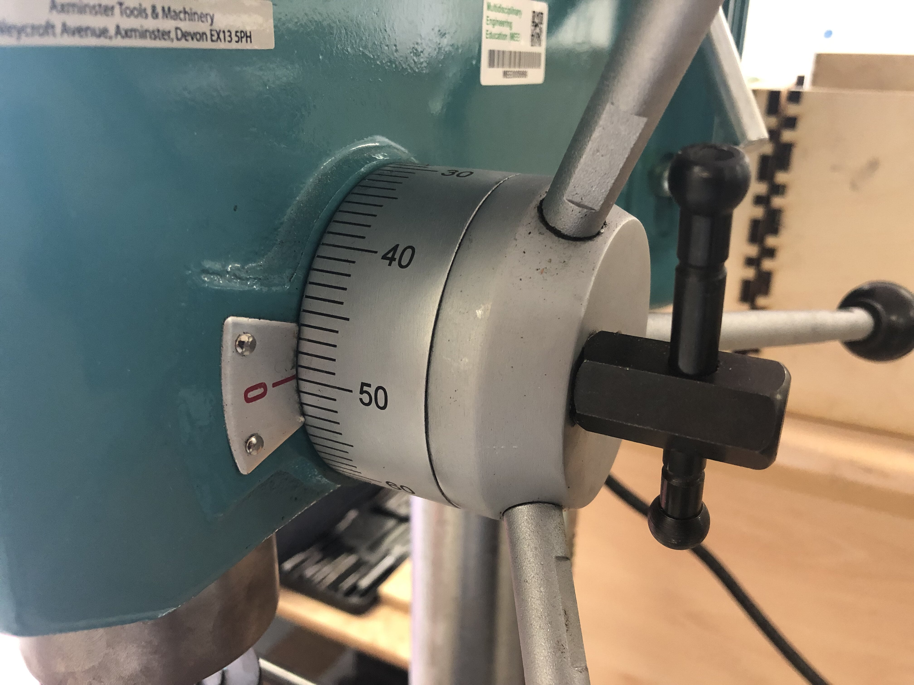

---

## Fix

1. Loosen the handle of the table to move it up/down/around.

2. Loosen the screw on the knob gauge, turn it to a larger value then tighten it.

---

##### If have any other problems or still not working, please contact hardware team